# Chroma Discord App (Unofficial)

Enable `Chroma` lighting in the `Discord App for Windows`

## Table of Contents

* [See Also](#see-also)
* [Releases](#releases)
* [Dependencies](#dependencies)
* [Quick Start](#quick-start)
* [Discord Events](#discord-events)
* [Overview](#overview)

## See Also

**Docs:**

- [Chroma Animation Guide](http://chroma.razer.com/ChromaGuide/) - Visual examples of the Chroma Animation API methods

**Apps:**

- [ChromaClientForDiscord](https://github.com/tgraupmann/ChromaDiscordApp) - Add Chroma lighting to the Discord App events

- [ChromaClientForTwitch](https://github.com/tgraupmann/ChromaTwitchExtension) - Add Chroma lighting to the Twitch streaming experience

**Plugins:**

- [CChromaEditor](https://github.com/RazerOfficial/CChromaEditor) - C++ native MFC library for playing and editing Chroma animations

- [ClickTeamFusion_ChromaSDK](https://github.com/RazerOfficial/ClickTeamFusion_ChromaSDK) - Click Team Fusion Chroma SDK Extension for playing Chroma animations

- [GameMakerChromaExtension](https://github.com/RazerOfficial/GameMakerChromaExtension) - GameMaker extension to control lighting for Razer Chroma

- [Godot_ChromaSDK](https://github.com/RazerOfficial/Godot_ChromaSDK) - Godot native library for playing Chroma animations

- [HTML5ChromaSDK](https://github.com/RazerOfficial/HTML5ChromaSDK) - JavaScript library for playing Chroma animations

- [UE4_XDK_SampleApp](https://github.com/razerofficial/UE4_XDK_SampleApp) - UE4 Chroma samples and runtime module with Blueprint library for the ChromaSDK

- [UnityNativeChromaSDK](https://github.com/RazerOfficial/UnityNativeChromaSDK) - Unity native library for the ChromaSDK

## Releases

* [Chroma Discord App (Unofficial) Installer](https://github.com/tgraupmann/ChromaDiscordApp/releases/tag/1.0) for Windows

## Dependencies

* [Discord App for Windows](https://discordapp.com/) - The `Discord` client handles authentication

## Quick Start

* Install [Synapse](https://www.razer.com/synapse-3)

* Make sure the Chroma Connect module is installed.

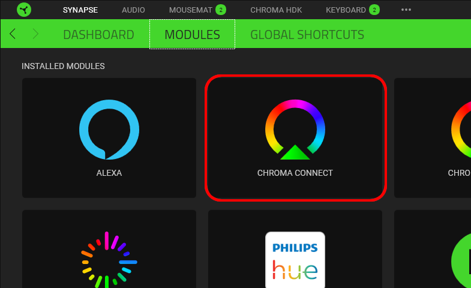

* If you don't have Chroma hardware, you can see Chroma effects with the [Chroma Emulator](https://github.com/razerofficial/ChromaEmulator)

* Install and run `Discord App for Windows`

* Install and run `Chroma Discord App (Unofficial)`

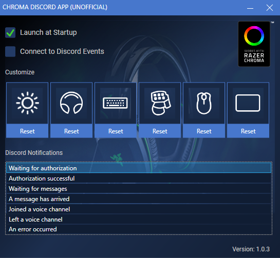

* Check `Connect to Discord Events`

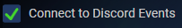

* Authorize `Chroma` to interact with `Discord` events.

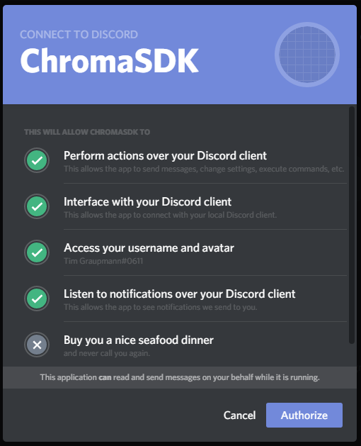

* Your Discord status needs to be `online` in order to receive message events.

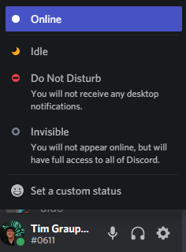

## Discord Events

Chroma lighting animations will play for the following Discord events.

**Authorization successful**

**Waiting for messages**

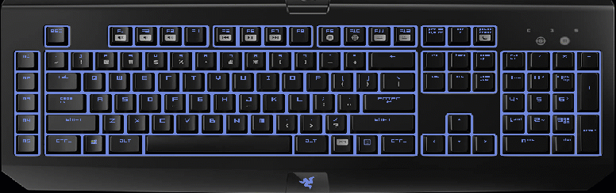

**A message has arrived**

**Joined a voice channel**

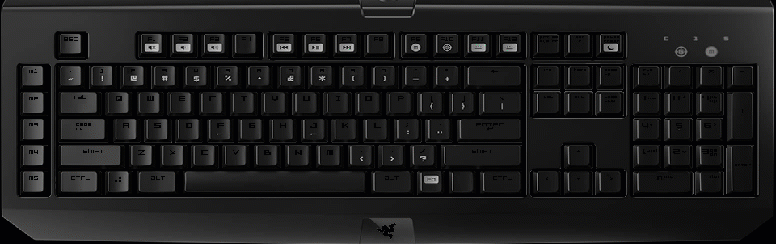

**Left a voice channel**

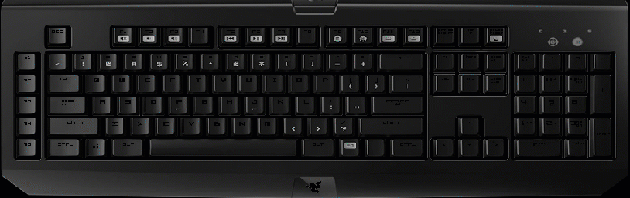

**An error occurred**

## Overview

Use `Synapse` to control the `Chroma` app priority. The `topmost` entry will take priority when multiple `Chroma` sessions are active.

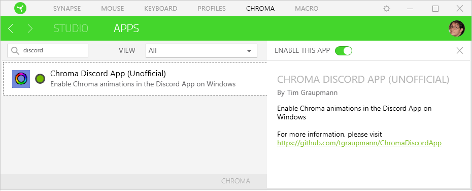

The application keeps an icon in the system tray with a context menu to either `show` or `quit` the application.

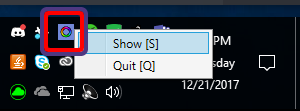

When `Launch at Startup` is checked, the application will launch when the user logs into Windows.

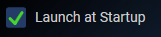

When `Connect to Discord Events` is checked, `Chroma` animations will play when `Discord` events are detected. The `Discord App` will prompt for authentication when checked for the first time.

Also when `Connect to Discord Events` is checked, the `Chroma` animations cannot be customized.

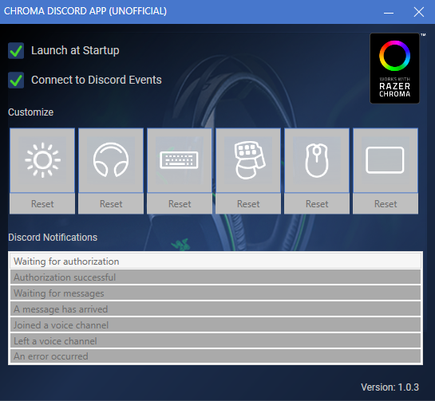

Uncheck `Connect to Discord Events` to customize `Chroma` animations.

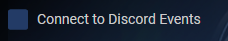

Select a `Discord Notifications` event which will autoplay the selected animation on connected `Chroma` devices.

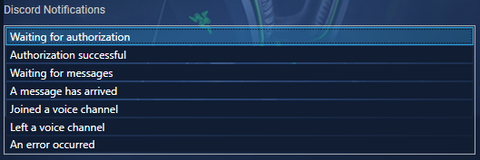

Select a `Chroma` device icon in order to customize the selected animation for that device.

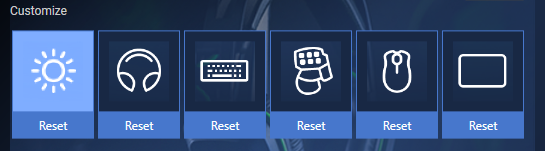

The animation editor will appear when editing a `Chroma` animation.

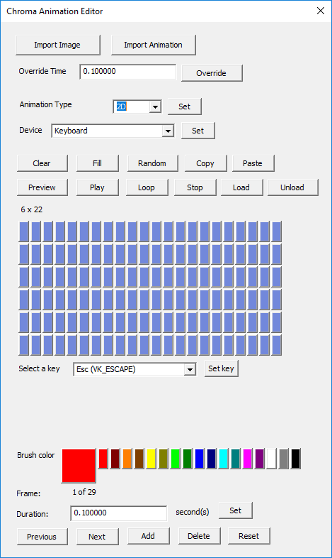

Use the device `Reset` button to reset a `Chroma` animation back to the default for the selected `Discord` event.

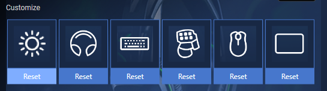

# Support

Support is available on Discord, you can reach me at `Tim Graupmann#0611`.
