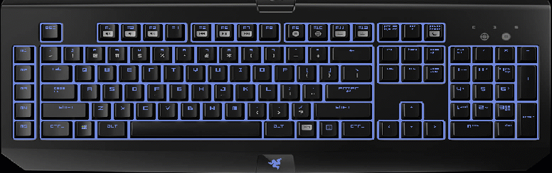

# Chroma Discord App (Unofficial)

Enable `Chroma` lighting in the `Discord App for Windows`

## Table of Contents

* [See Also](#see-also)
* [Releases](#releases)
* [Dependencies](#dependencies)
* [Quick Start](#quick-start)
* [Discord Events](#discord-events)
* [Overview](#overview)

## See Also

* [CChromaEditor](https://github.com/RazerOfficial/CChromaEditor) - Editor for editing Chroma animations

* [ChromaTwitchExtension](https://github.com/tgraupmann/ChromaTwitchExtension) - Adds Chroma lighting to the Twitch streaming experience

## Releases

* [Chroma Discord App (Unofficial) Installer](https://github.com/tgraupmann/ChromaDiscordApp/releases/tag/1.0) for Windows

## Dependencies

* [Razer Synapse](https://www.razerzone.com/synapse) - Control `Chroma` application priority

* [Razer Chroma SDK](http://developer.razerzone.com/works-with-chroma/download/) - Allow applications to control `Chroma` lighting. The `ChromaSDK` is automatically installed by `Synapse` when a `Chroma` device is connected.

* [Discord App for Windows](https://discordapp.com/) - The `Discord` client handles authentication

## Quick Start

* Install `Synpase`

* Install `ChromaSDK`

* Install and run `Discord App for Windows`

* Install and run `Chroma Discord App (Unofficial)`

* Check `Connect to Discord Events`

* Authorize `Chroma` to interact with `Discord` events.

## Discord Events

Chroma lighting animations will play for the following Discord events.

** Waiting for authorization **

** Authorization successful **

** Waiting for messages **

** A message has arrived **

** Joined a voice channel **

** Left a voice channel **

** An error occurred **

## Overview

Use `Synapse` to control the `Chroma` app priority. The `topmost` entry will take priority when multiple `Chroma` sessions are active.

The application keeps an icon in the system tray with a context menu to either `show` or `quit` the application.

When `Launch at Startup` is checked, the application will launch when the user logs into Windows.

When `Connect to Discord Events` is checked, `Chroma` animations will play when `Discord` events are detected. The `Discord App` will prompt for authentication when checked for the first time.

Also when `Connect to Discord Events` is checked, the `Chroma` animations cannot be customized.

Uncheck `Connect to Discord Events` to customize `Chroma` animations.

Select a `Discord Notifications` event which will autoplay the selected animation on connected `Chroma` devices.

Select a `Chroma` device icon in order to customize the selected animation for that device.

The animation editor will appear when editing a `Chroma` animation.

Use the device `Reset` button to reset a `Chroma` animation back to the default for the selected `Discord` event.

